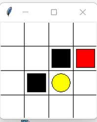
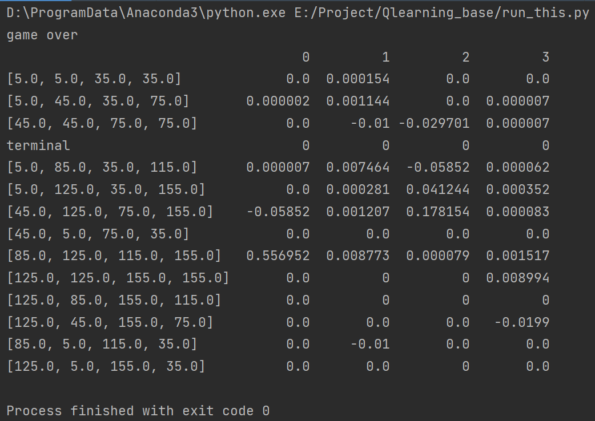

# QTable
 QTable algorithm by Pytorch - a simple maze game

# 算法讲解
Q-learning算法介绍_q learning算法_好程序不脱发的博客
https://blog.csdn.net/ningmengzhihe/article/details/129988497

# 项目简介
它是一个简单的迷宫游戏，如下图这样

玩游戏结果如下：

